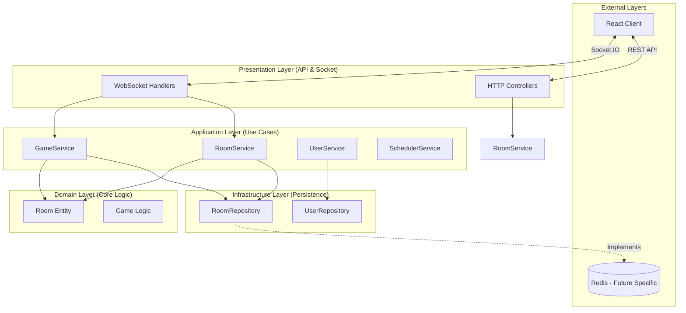
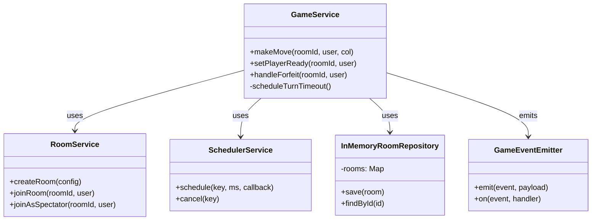
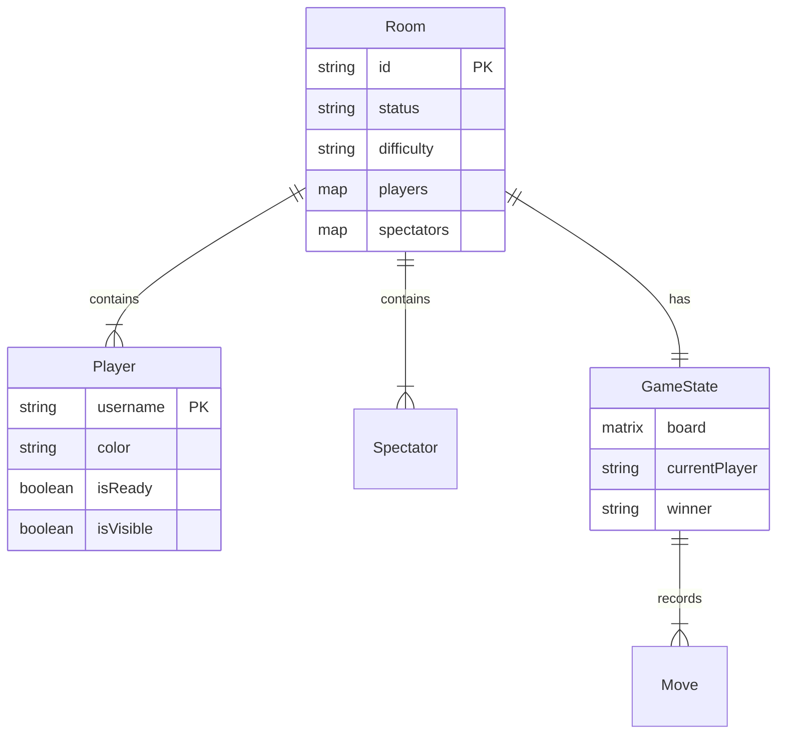
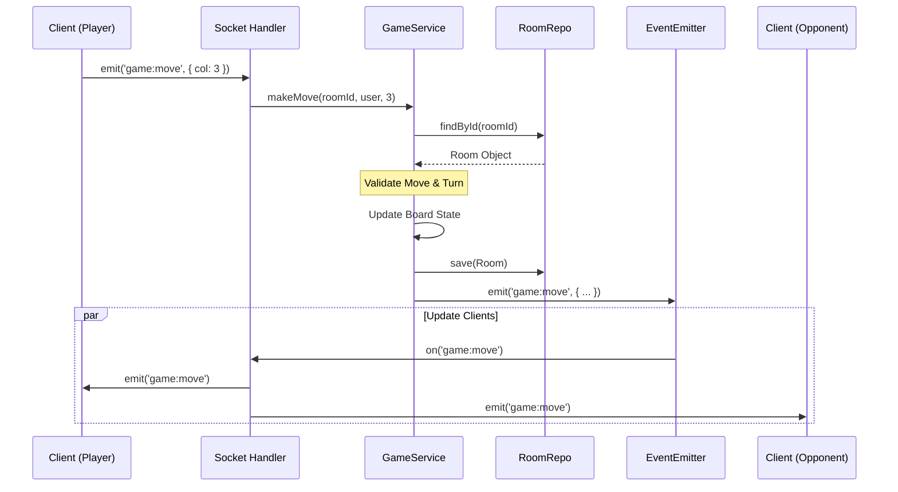
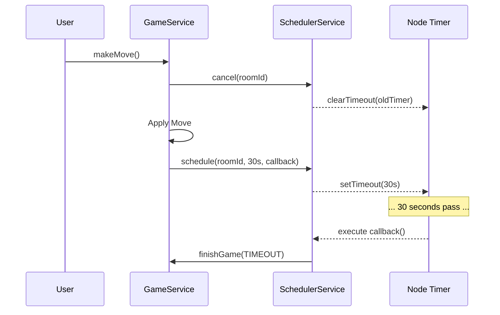

# ConnectX System Design & Architecture

## 1. High-Level Architecture
The system follows a **Hexagonal / Clean Architecture** pattern, separating the core domain logic from external interfaces (API, WebSockets, Database).

## 2. Core Class Structure
The `GameService` is the heart of the system, coordinating between the repository, the scheduler, and the domain events.

## 3. Game Data Model (In-Memory)
The "Database" is currently an in-memory Map, but the structure is relational-ready.

## 4. Sequence: Making a Move
How data flows when a player clicks a column.

## 5. Sequence: Turn Timeout (Event-Driven)
How the new SchedulerService creates an O(1) timeout mechanism.

